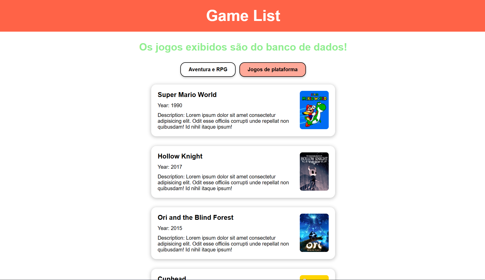

# Lista de Jogos

Site feito com o objetivo de consumir a API construída durante um Intensivão de Java Spring. Caso o backend não esteja rodando, será usado os dados do JSON e avisar na tela. Quando o site estiver rodando junto com o backend, irá aparecer botões na tela das categorias de jogos, permitindo que o usuário escolha os cards de jogos que irão aparecer.

## Como visualizar o projeto
Para visualizar o site, basta clicar no link abaixo:

https://znathan2303.github.io/frontend-game-list/

## Tecnologias
* HTML
* CSS
* JavaScript
* JSON

## Autor
[Nathan da Silva Costa](<https://www.linkedin.com/in/nathandasilvacosta/>)